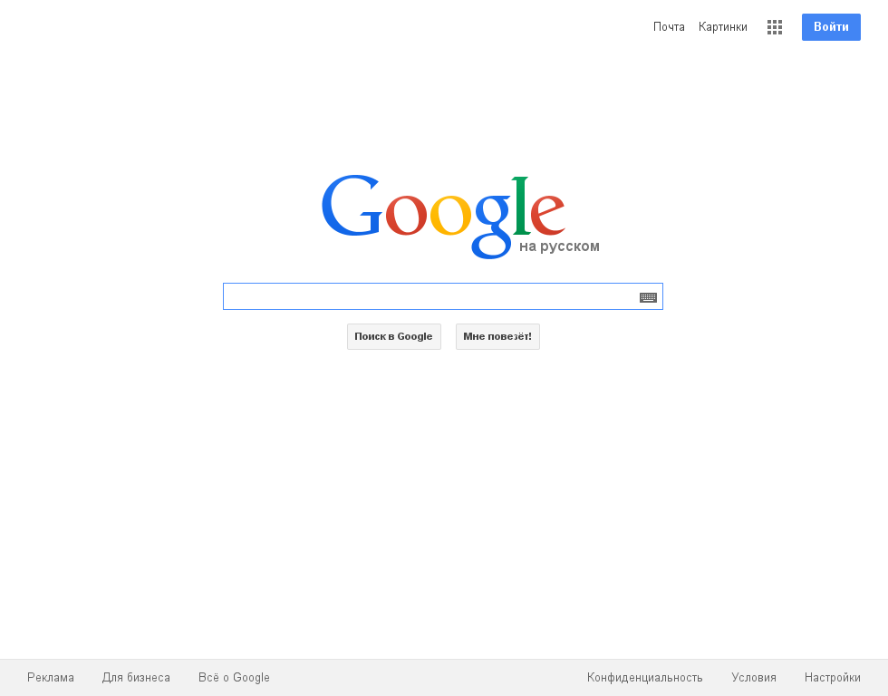

Title: Ралли на браузерах
Date: 2015-04-01 10:20
Modified: 2015-04-05 19:30
Category: Python
Tags: browsers, wb-tech
Slug: test-screenshot
Summary:
    Собственный проект [WB--Tech](http://wbtech.pro/) по комментированию
    скриншотов [coment.me](http://coment.me/) на сегодняшний день, для получения
    снимка сайта использует связку `selenium + firefox`. Данный подход решает
    задачи получения скриншота, однако тратит достаточно много памяти, и к тому же
    со временем накапливается большое количество повисших процессов, что в свою
    очередь приводит к подвисанию сервиса. В связи с этим, необходимо исследовать
    доступные варианты и определить наилучший из браузеров для автоматического
    создания скриншотов...
#

Собственный проект [WB--Tech](http://wbtech.pro/) по комментированию
скриншотов [coment.me](http://coment.me/) на сегодняшний день, для получения
снимка сайта использует связку `selenium + firefox`. Данный подход решает
задачи получения скриншота, однако тратит достаточно много памяти, и к тому же
со временем накапливается большое количество повисших процессов, что в свою
очередь приводит к подвисанию сервиса. В связи с этим, необходимо исследовать
доступные варианты и определить наилучший из браузеров для автоматического
создания скриншотов.

Критерииями для выбора победителя будут являтся:

- Качество скриншотов
- Скорость работы
- Затрачиваемые ресурсы

##Участники соревнований
На участие в ралли были отобранны следующие кандидаты:

- Firefox `36.0.1`
- Google Chrome `41.0.2272.89`
- Chromium `Not tested`
- [Splash](http://splash.readthedocs.org/en/latest/) `1.5`
- [Ghost.py](http://ghost-py.readthedocs.org/en/latest/) `0.1.1`
- [Zombie.js](https://github.com/ryanpetrello/python-zombie/) `0.2.0`
- [Pantom.js](http://phantomjs.org/) `1.9.8`, `2.0.0`
- [Slimer.js](http://slimerjs.org/) `0.9.5`, `0.10.0pre`

Познакомимся с участниками поближе:

- *Firefox* -- Наиболее массовый не `WebKit` браузер на сегодняшний день.
- *Google Chrome* / *Chromium* -- Один из самых быстрых и популярных
браузеров.
- *Splash* -- легкий браузер с поддержкой `javascript` реализовыннй на
`python`-е предоставляюший для управления `http api`.
- *Ghost.py* -- `python` браузер с поддержкой `javascript` ориентированный
на автоматическое функциональное тестирование.
- *Zombie.js* -- легкий и быстрый безголовый браузер для автоматического
тестирования основаный на `node.js`.
- *Phantom.js* -- быстрый безголовый браузер на движке `WebKit` со
встроенной поддержкой `svg`. Управляется при помощи `javascript api`.
- *Slimer.js* -- быстрый браузер, похожий на `phantom.js`, однако использует
движок `Gecko` от `firefox`. Управляется при помощи `javascript api`.


Итак, участники отобраны, и готовы показать себя во всей красе, что ж --
приступим к соревнованиям.


##Трасса


Нашим замечательным конкурсантам предстоит пройти трек по пересеченной
местности с четырьмя крутыми поворотами с 16-ю чекпоинтами, а именно:
показать свои навыки на следующих ресурсах:

- [https://google.com/]()
- [https://www.facebook.com/]()
- [http://habrahabr.ru/]()
- [http://wbtech.pro/]()

при следующих разрешениях экранов по ширине: `240`, `780`, `1320`, `1920`
пикселей.

##Заезд первый -- "Качество"
>Качество -- это делать что-либо правильно, даже когда никто не смотрит.

Поскольку, в конечном счете, результат должен быть не хуже, чем имеющийся на
настоящий момент -- эталоном качества будут выступать снимки `firefox`-а.

На данном этапе сошли с дистанции сразу 4 участника. Причем, если бы я делал
ставки, то проиграл бы, ведь хром, которого я считал фаворитом
соревнований, оказался абсолютно некомпетентным участником.

####Только видимая область
Для связки `selenium`-а и `google chrome`
необходимо использовать `chromedriver` текущая стабильная версия `2.14`.
И, как оказалось, в нем содержится баг, который тянется с 2013 года, известным
[issue](https://code.google.com/p/chromedriver/issues/detail?id=294).
Хром драйвер не пролистывает окно браузера при захвате изображения,
а делает снимок видимой области.
>{.shadow}

Так что `Google Chrome` и `Chromium` не прошли данный этап.

####Неверный resize
Безголовый браузер `Splash`, запускается демоном и слушает `localhost:8050`, по
которому предоставляет `http api` управления браузером. Для сохранения скриншота
необходимо указать адрес сайта и ширину окна браузера.
```python
request = 'http://localhost:8050/render.png?url={url}&width={res}&render_all=1&wait=1'.format(url=url, res=res)
res = subprocess.check_call(['curl', request, '-o', save_as])
```
Однако, как оказалось, ширина окна браузера всегда 1024px, а параметр
`width` влияет только на фактическую ширину полученного изображения,
к тому же сжатого как `thumbnail`.

>240px<br />{.shadow}
><hr />
>780px<br />{.shadow}

Так что `splash` не прошел данный этап.

####"Что я вообще сдесь делаю" &copy; Zombie


Как оказалось, Зомби вообще не умеет делать скриншоты, поэтому выбывает из
соревнований.

####Фальшивые паспорта -- старый гугл
Некоторые из участников соревнований, а именно `Phantom.js` и `Slimer.js`
не смогли бы пройти все этапы ралли, под своими именами, поэтому пришлось
выдать им фальшивые паспорта.

Google выдает различные версии сайта, в зависимости от того: какой `user agent` у
браузера запрашивающего страницу, и если этот агент неизвестный или старый, то
выдается старая версия google, с черной полоской меню.
>Phantom.js 240px<br />{.shadow}
><hr />
>Slimer.js 240px<br />{.shadow}

Но при использовании поддельных паспортов, от `firefox` результат такой как
нужно.
```python
'Mozilla/5.0 (X11; Linux x86_64) Gecko/20100101 Firefox/36.0'
```
>{.shadow}


####Пикселизация -- выколи глаза.
`Ghost.py` не очень хорошо умеет захватывать картинки, логотип google выглядит
похожим на забор.
>{.shadow}

Хоть это и недопустимо, однако, ограничимся предупреждением, и пропустим
`Ghost.py` в следующий тур.

###Результаты первого заезда
Во второй тур прошли 4 участника и 4 участника покинули соревнования.
Турнирная таблица по окончанию первого этапа.

- :white_check_mark: Firefox
- :white_check_mark: Pantom.js
- :white_check_mark: Slimer.js
- :warning: Ghost.py
- :x: Chromium
- :x: Google Chrome
- :x: Splash
- :x: Zombie.js

##Заезд второй -- "Скорость"


На данном этапе измерялось время, необходимое для создания браузера,
открытия нужной страницы, изменения ширины окна до заданной, сохранения страницы
как изображения `PNG`, закрытия страницы и уничтожения объекта браузера.

Измерения проводились при помощи стандартной библиотеки `time`, как разница
времени между началом запуска функции и её окончания.

```python
import time
# ...
    start = time.time()
    # call test browser fun()
    end = time.time()
# ...
    times.append(end - start)
```

<p><strong>Легенда:</strong>
    <ul class="browsers1"></ul>
</p>
<h5>Time</h5>
<div><canvas id="canvas-time"></canvas></div>


###Результаты второго заезда
В ходе данного этапа участники заняли следующие места:

1. Phantom.js `2.x`
1. Phantom.js `1.x`
1. Ghost.py
1. Phantom.js `1.x` + selenium
1. Phantom.js `2.x` + selenium
1. Slimer.js `9.x`
1. Slimer.js `10.x`
1. Firefox + selenium

В результате, ни один из участников не оказался значительно хуже чем `firefox`,
поэтому выбывших нет, все переходят к следующему этапу.

##Заезд третий -- "Ресурсы"


Учитывалась память, которую тратит главный процесс, и все его дочерние процессы.
Память измерялась при помощи функции `memory_usage` библиотеки `memory_profiler`
с указанием параметра `include_children`.

Измерялась минимальная, средняя и максимальная память для каждого скриншота.

```python
from memory_profiler import memory_usage
# ...
    memory = memory_usage((fun, args), include_children=True)
# ...
    mins.append(min(memory))
    maxs.append(max(memory))
    avgs.append(avg(memory))
```

####Ненасытное привидение
`Ghost.py` оказался чрезвычайно прожорливым, занимая всю доступную
память, доходил до максимума и вылетал. Единственный из участников, кто не
сумел пройти все 16 чекпоинтов за один подход.

Учитывая вынесенное ранее предупреждение, призрак вылетает из конкурса!
>I ain't afraid of no ghosts


####Двуличный хитрец
Оказалось, что `Slimer.js` притворяется: запускается дочерний процесс `slimerjs`,
который потребляет не более 3&nbsp;Mb памяти, но при этом запускает ещё один
дочерний процесс с именем `firefox`, который уже добирает память до 300&nbsp;Mb.

####Общие затраты памяти
Поскольку `Ghost.py` потребляет уж слишком много ресурсов, на графиках не
указывается.

<p><strong>Легенда:</strong>
    <ul class="browsers2"></ul>
</p>
<h5>Memory max</h5>
<div><canvas id="canvas-memory_max"></canvas></div>

<h5>Memory avg</h5>
<div><canvas id="canvas-memory_avg"></canvas></div>

###Результаты третьего заезда
В ходе данного этапа участники заняли следующие места:

1. Phantom.js `1.x`
1. Phantom.js `2.x`
1. Phantom.js `1.x` + selenium
1. Phantom.js `2.x` + selenium
1. Slimer.js `9.x`
1. Slimer.js `10.x`
1. Firefox + selenium
1. Ghost.py

На этом этапе выбывает `Ghost.py`, турнирная таблица принимает вид:

- :white_check_mark: Pantom.js
- :white_check_mark: Slimer.js
- :white_check_mark: Firefox
- :x: Ghost.py

##Заезд четвертый -- "Управляемость"


Несмотря на то, что определилась тройка лидеров и уже можно подвести итоги,
рассмотрим как управлять безголовыми браузерами.

####Firefox
`Firefox` работает в связке с `selenium`-ом и управляется достаточно просто,
единственная особенность -- это то, что браузер запускает графическую
оболочку, поэтому нужно использовать виртуальный дисплей.

```python
from selenium import webdriver
from pyvirtualdisplay import Display
# ...
with Display(visible=0, size=(1024, 768), backend='xvfb'):
    browser = Browser(**param)
    browser.set_window_size(width, 768)
    browser.get(url)
    browser.save_screenshot(save_as)
    browser.quit()
```

####Phantom
`Phantom.js` можно использовать, как самостоятельный безголовый браузер, так и
в связке с `selenium`-ом.
Работа с `selenium`-ом аналогична `firefox`, за тем лишь исключением, что нет
необходимости запускать виртуальный дисплей.

Собственная работа `phantom.js`, заключается в вызове консольной команды,
и передаче ей скрипта для выполнения браузером.

```javascript
var page = require('webpage').create();
page.settings.userAgent = 'Mozilla/5.0 (X11; Linux x86_64) Firefox/36.0';
page.viewportSize = { width:1920, height:768 };
page.open('http://wbtech.pro/', function (status) {
    page.render('img/phantomjs2-no_selenium/wbtech.pro-1920px.png');
    phantom.exit();
});
```
В `python` запускаем браузер с помощью стандартной библиотеки `subprocess`.

```python
import subprocess
# ...
subprocess.check_call([phantom_path, script_path, '--ssl-protocol=any'])
```

####Slimer
`Slimer.js` работает точно так же, как и `phantom.js` без `selenium`-а,
но является не совсем безголовым, он запускает графическую оболочку, поэтому
требует виртуальный дисплей.

А так же, в ходе тестирования было [http://stackoverflow.com/questions/29280104/slimerjs-takes-a-snapshot-of-only-the-visible-area/](выявлено),
что для корректного скриншота нужно всегда, перед открытием страницы,
указывать базовую ширину окна браузера.

```javascript
var page = require('webpage').create();
page.viewportSize = { width:1024, height:768 };
page.settings.userAgent = 'Mozilla/5.0 (X11; Linux x86_64) Firefox/36.0';
page.open('http://wbtech.pro/', function (status) {
    page.viewportSize = { width:1920, height:768 };
    page.render('img/slimerjs10/wbtech.pro-1920px.png');
    page.close();
    slimer.exit();
});
```
В `python` запускаем браузер с помощью стандартной библиотеки `subprocess`.

```python
from pyvirtualdisplay import Display
import subprocess
# ...
with Display(visible=0, size=(1024, 768), backend='xvfb'):
    subprocess.check_call([slimer_path, script_path, '--ssl-protocol=any'])
```

##Финиш


Гонка завершилась, пришло время подвести итоги и определить победителей.

До финиша доехали всего три команды, так что тройка лидеров очевидна. Учитывая
затраты ресурсов и времени, участники занимают следующие места:

1. Phantom.js `2.x`
1. Phantom.js `1.x`
1. Phantom.js `1.x` + selenium
1. Phantom.js `2.x` + selenium
1. Slimer.js `9.x`
1. Slimer.js `10.x`
1. Firefox + selenium

Безоговорочным лидером гонки стал `phantom.js`, в качестве награды ему будет
предложено занять пост `firefox`-а на сервисе [coment.me](http://coment.me/).


<script type="text/javascript" src="extra/browsers/chart.min.js"></script>
<script type="text/javascript" src="extra/browsers/data.js"></script>
